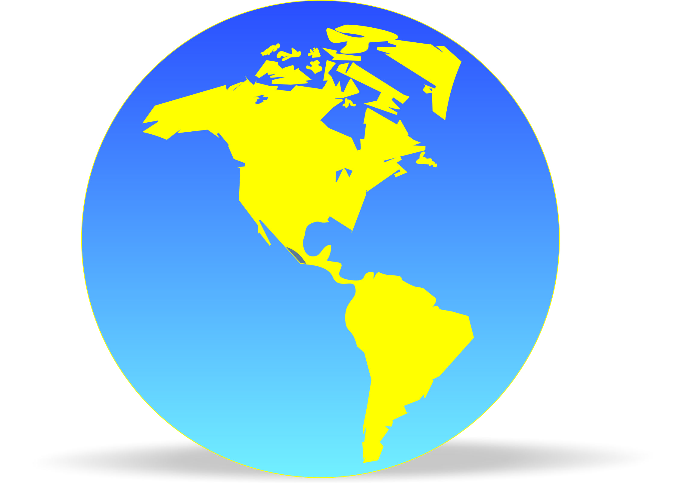
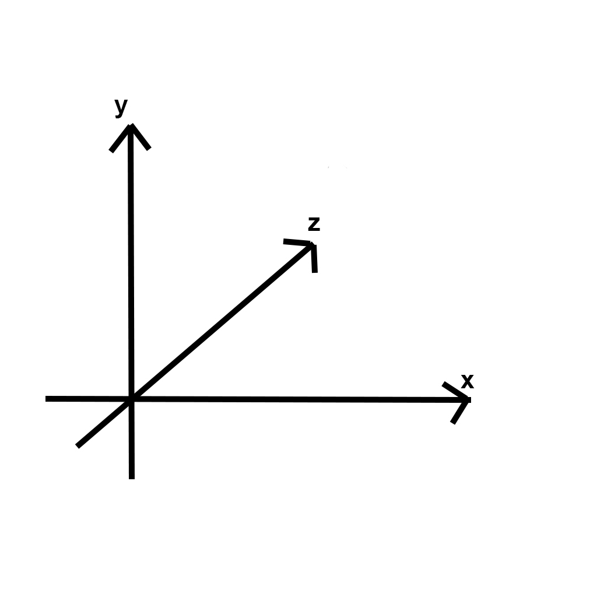
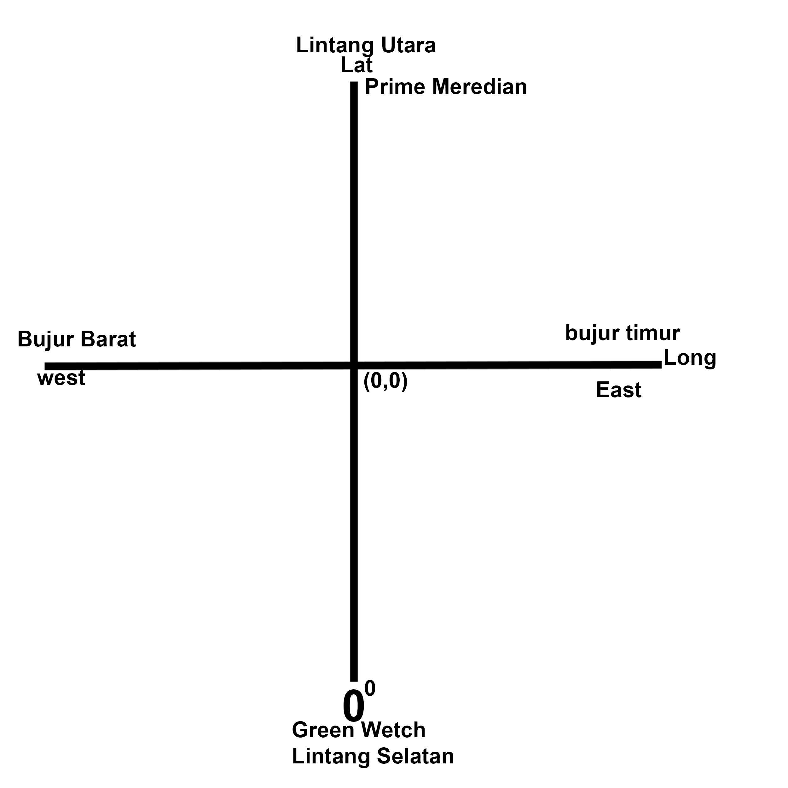

**RESUME PERTEMUAN 1 SISTEM INFORMASI GEOGRAFIS**

  

**Latar Belakang Masalah**

1. **1.** Apa itu Sistem?
2. **2.** Apa itu Infromasi?
3. **3.** Apa itu Geografis?
4. **4.** Apa itu Sistem Informasi Geografis?
5. **5.** Apa itu Geospacial?
6. **6.** Apa itu Koordinat?

- Sistem adalah suatu alur,plot,cerita dan tatacara yang telah tersusun.
- Informasi adalah suatu output hasil pengolahan data disuatu media.
- Geografis adalah suatu bentuk atau pola muka bumi.
- Sistem Informasi Geografis adalah suatu alur atau tatacara yang menjelaskan suatu output hasil pengolahan data pada bentuk dan pola muka bumi.
- Geospacial adalah suatu ruang yang menunjukkan posisi dan lokasi suatu objek dipermukaan bumi.

Berikut merupakan contoh dari gambar Geospacial:

  

- Koordinat adalah suatu titik yang memiliki garis lintang dan garis bujur.

Berikut merupakan contoh dari gambar koordinat:

  

**Penutup**

Kesimpulan:

Kesimpulan dari pertemuan pertama yaitu kita dapat mengetahui dan mengenal sistem informasi geografis serta fungsi dari sistem informasi geografis itu sendiri kemudian juga dapat mengetahui aplikasi yang digunakan dalam sistem informasi geografis.

Saran:

Saran dari saya yaitu agar penjelasan mata kuliah sistem informasi geografis dapat lebih kompleks lagi agar kita tidak kesulitan dalam memahami materi.