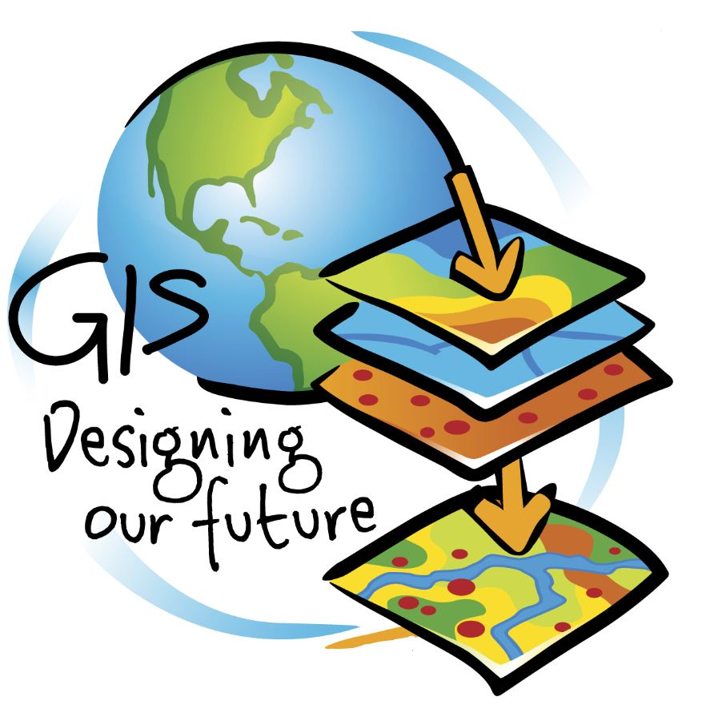

**Resume Pertemuan 10 Sistem Informasi Geografis**

  

Latar belakang

1. Apa itu Open Layer?
2. Apa yang dimaksud Marker?
3. Apa yang dimaksud overlay?
4. Bagaimana cara menampilkan marker menggunakan Open Layer?

**ISI**

**Open Layer adalah** library javascript murni untuk menampilkan data peta di berbagai browser, tanpa server side dependencies. Open Layer mengimplementasikan javascript API untuk membangun rich web-based geographic application yang mirip dengan Google Maps dan MSN Virtual Earth APIS

**Marker merupakan** penciri individu yang dilihat oleh mata atau terdeteksi dengan alat tertentu yang menunjukkan genotype suatu individu. Di dalam sebuah peta atau maps, marker adalah suatu tanda yang menjelaskan atau memberitahukan suatu tempat atau wilayah agar user mengetahui lokasi yang dimaksud

**Overlay merupakan** proses penempatan grafis suatu peta diatas grafis peta lainnya agar menghasilkan gabungan kedua peta yang memiliki informasi atribut dari kedua peta tersebut. Teknik overlay dalam sistem informasi geografis ada 2 yaitu gabungan (union) dan irisan (intersect).

**Cara membuat marker dengan open layer terdiri dari:**

- Buka web  [http://openlayers.org/en/latest/examples/overlay.html?q=overlay](http://openlayers.org/en/latest/examples/overlay.html?q=overlay)
- Copy codenya dan edit seperti dibawah ini:

&lt;!DOCTYPE html&gt;

&lt;html&gt;

  &lt;head&gt;

    &lt;title&gt;Overlay&lt;/title&gt;

    &lt;link rel=&quot;stylesheet&quot; href=&quot;https://openlayers.org/en/v3.20.1/css/ol.css&quot; type=&quot;text/css&quot;&gt;

    &lt;!-- The line below is only needed for old environments like Internet Explorer and Android 4.x --&gt;

    &lt;script src=&quot;https://cdn.polyfill.io/v2/polyfill.min.js?features=requestAnimationFrame,Element.prototype.classList,URL&quot;&gt;&lt;/script&gt;

    &lt;script src=&quot;https://openlayers.org/en/v3.20.1/build/ol.js&quot;&gt;&lt;/script&gt;

    &lt;script src=&quot;https://code.jquery.com/jquery-2.2.3.min.js&quot;&gt;&lt;/script&gt;

    &lt;link rel=&quot;stylesheet&quot; href=&quot;https://maxcdn.bootstrapcdn.com/bootstrap/3.3.6/css/bootstrap.min.css&quot;&gt;

    &lt;script src=&quot;https://maxcdn.bootstrapcdn.com/bootstrap/3.3.6/js/bootstrap.min.js&quot;&gt;&lt;/script&gt;

    &lt;style&gt;

      #marker {

        width: 20px;

        height: 20px;

        border: 1px solid #088;

        border-radius: 10px;

        background-color: #FF3300;

        opacity: 0.5;

      }

      #marker2 {

        width: 20px;

        height: 20px;

        border: 1px solid #088;

        border-radius: 10px;

        background-color: #FF3300;

        opacity: 0.5;

      }

      #marker3 {

        width: 20px;

        height: 20px;

        border: 1px solid #088;

        border-radius: 10px;

        background-color: #FF3300;

        opacity: 0.5;

      }

      #bandung {

        text-decoration: none;

        color: black;

        font-size: 11pt;

        font-weight: bold;

        text-shadow: white 0.1em 0.1em 0.2em;

      }

      #lampung {

        text-decoration: none;

        color: black;

        font-size: 11pt;

        font-weight: bold;

        text-shadow: white 0.1em 0.1em 0.2em;

      }

      #ciamis {

        text-decoration: none;

        color: black;

        font-size: 11pt;

        font-weight: bold;

        text-shadow: white 0.1em 0.1em 0.2em;

      }

      .popover-content {

        min-width: 180px;

      }

    &lt;/style&gt;

  &lt;/head&gt;

  &lt;body&gt;

    &lt;div id=&quot;map&quot; class=&quot;map&quot;&gt;&lt;/div&gt;

    &lt;div style=&quot;display: none;&quot;&gt;

      &lt;!-- Clickable label --&gt;

      &lt;a class=&quot;overlay&quot; id=&quot;bandung&quot; target=&quot;\_blank&quot; href=&quot;http://id.wikipedia.org/wiki/Kota\_Bandung&quot;&gt;Bandung&lt;/a&gt;

      &lt;div id=&quot;marker&quot; title=&quot;Marker&quot;&gt;&lt;/div&gt;

      &lt;a class=&quot;overlay&quot; id=&quot;lampung&quot; target=&quot;\_blank&quot; href=&quot;http://id.wikipedia.org/wiki/Lampung&quot;&gt;Lampung&lt;/a&gt;

      &lt;div id=&quot;marker2&quot; title=&quot;Marker&quot;&gt;&lt;/div&gt;

      &lt;a class=&quot;overlay&quot; id=&quot;ciamis&quot; target=&quot;\_blank&quot; href=&quot;http://id.wikipedia.org/wiki/Ciamis&quot;&gt;Ciamis&lt;/a&gt;

      &lt;div id=&quot;marker3&quot; title=&quot;Marker&quot;&gt;&lt;/div&gt;

      &lt;!-- Popup --&gt;

      &lt;div id=&quot;popup&quot; title=&quot;Welcome to ol3&quot;&gt;&lt;/div&gt;

    &lt;/div&gt;

    &lt;script&gt;

      var layer = new ol.layer.Tile({

        source: new ol.source.OSM({

              url: &#39;https://map.vas.web.id/wmts/agm/webmercator/{z}/{x}/{y}.png&#39;

            })

      });

      var map = new ol.Map({

        layers: [layer],

        target: &#39;map&#39;,

        view: new ol.View({

          center: ol.proj.transform([118.015776, -2.6000285], &#39;EPSG:4326&#39;, &#39;EPSG:3857&#39;),

          zoom: 5

        })

      });

      var pos = ol.proj.fromLonLat([107.5731165, -6.9034443]);

      var pos2 = ol.proj.fromLonLat([105.200697, -5.4285755]);

      var pos3 = ol.proj.fromLonLat([108.1664208, -7.311218]);

      // marker

      var marker = new ol.Overlay({

        position: pos,

        positioning: &#39;center-center&#39;,

        element: document.getElementById(&#39;marker&#39;),

        stopEvent: false

      });

      map.addOverlay(marker);

      var marker2 = new ol.Overlay({

        position: pos2,

        positioning: &#39;center-center&#39;,

        element: document.getElementById(&#39;marker2&#39;),

        stopEvent: false

      });

      map.addOverlay(marker2);

      var marker3 = new ol.Overlay({

        position: pos3,

        positioning: &#39;center-center&#39;,

        element: document.getElementById(&#39;marker3&#39;),

        stopEvent: false

      });

      map.addOverlay(marker3);

      // label

      var bandung = new ol.Overlay({

        position: pos,

        element: document.getElementById(&#39;bandung&#39;)

      });

      map.addOverlay(bandung);

      var lampung = new ol.Overlay({

        position: pos2,

        element: document.getElementById(&#39;lampung&#39;)

      });

      map.addOverlay(lampung);

      var ciamis = new ol.Overlay({

        position: pos3,

        element: document.getElementById(&#39;ciamis&#39;)

      });

      map.addOverlay(ciamis);

      // Popup showing the position the user clicked

      var popup = new ol.Overlay({

        element: document.getElementById(&#39;popup&#39;)

      });

      map.addOverlay(popup);

      map.on(&#39;click&#39;, function(evt) {

        var element = popup.getElement();

        var coordinate = evt.coordinate;

        var hdms = ol.coordinate.toStringHDMS(ol.proj.transform(

            coordinate, &#39;EPSG:3857&#39;, &#39;EPSG:4326&#39;));

        $(element).popover(&#39;destroy&#39;);

        popup.setPosition(coordinate);

        // the keys are quoted to prevent renaming in ADVANCED mode.

        $(element).popover({

          &#39;placement&#39;: &#39;top&#39;,

          &#39;animation&#39;: false,

          &#39;html&#39;: true,

          &#39;content&#39;: &#39;&lt;p&gt;The location you clicked was:&lt;/p&gt;&lt;code&gt;&#39; + hdms + &#39;&lt;/code&gt;&#39;

        });

        $(element).popover(&#39;show&#39;);

      });

    &lt;/script&gt;

  &lt;/body&gt;

&lt;/html&gt;

**PENUTUP**

**KESIMPULAN**

OpenLayers merupakan Library JavaScript untuk menempatkan peta dinamis di halaman web, dan Overlay merupakan proses penempatan grafis suatu peta diatas grafis peta lainnya agar menghasilkan gabungan kedua peta yang memiliki informasi atribut dari kedua peta tersebut.

**Saran**

Saran saya sebaiknya pembelajaran tentang open layer dapat diperjelas dan diperdalam lagi agar lebih paham.

Link github:

https://github.com/yandarizky/sisteminformasigeografis

Nama : yanda rizky prasetiya

NPM : 1144004

Kelas : 3C

Prodi : D4 Teknik Informatika

Mata Kuliah : Sistem Informasi Geografis

Link mata kuliah: www.awangga.net

referensi: 

1. https://gedearta83.wordpress.com/2012/11/03/dokumentasi-openlayers/ 

2. https://id.wikipedia.org/wiki/Penanda_genetik

3. http://www.guntara.com/2013/01/pengertian-overlay-dalam-sistem.html

Scan Plagiarisme:

1. https://drive.google.com/open?id=0ByZqhNt9UFJ2dUdKRXZMcmtEa28

2. https://drive.google.com/open?id=0ByZqhNt9UFJ2aFpjMjg5OW5fc28