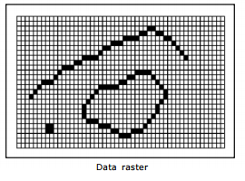

**Resume pertemuan 2 Sistem Informasi Geografis**

  

 
**Latar Belakang Masalah**

Seperti yang diketahui pengertian Geospasial adalah suatu ruang yang menunjukkan posisi dan lokasi suatu objek dipermukaan bumi.Gunung,air,lautan,jalanan itu merupakan contoh gambaran objek-objek yang ada dipermukaan bumi dan itu merupakan bagian dari data geospasial. Terdapat 2 macam data geospasial yaitu data raster dan data vektor.

1. Apa yang dimaksud dengan data vektor pada geospasial?
2. Apa kelebihan dan kekurangan dari data vektor?
3. Apa yang dimaksud dengan data raster pada geospasial?
4. Apa kelebihan dan kekurangan dari data raster?

**ISI**

**Data vektor** adalah data yang menampilkan dan mempresentasikan pola suatu ruang dimuka bumi dalam bentuk kurva,titik,garis dan polygon.data vektor ini biasanya digunakan untuk mempresentasikan jalan,gedung,rel kereta dan letak koordinat. berikut merupakan contoh dari data vektor:

  

Kelebihan dari data vektor ini sendiri yaitu ruang penyimpanannya lebih efisien dan memiliki resolusi spasial yang tinggi.

Kekurangan dari data raster ini sendiri yaitu data nya tidak mudah di manipulasi serta membutuhkan perangkat komputer yang lebih mahal.

**Data Raster** adalah data yang menampilkan dan mempresentasikan pola suatu ruang dimuka bumi ke dalam bentuk pixel yang membentuk grid atau petak yang dihasilkan dari pengideraan jarak jauh. Data raster biasanya digunakan untuk menggambarkan jenis tanah,vegetasi dan kelembapan tanah.berikut merupakan contoh dari data raster:

  

Kelebihan dari data raster yaitu teknologi yanh dibutuhkan cukup murah serta datanya yang mudah dimanipulasi.

Kekurangan dari data raster itu sendiri yaitu membutuhkan ruang penyimpanan yang besar.

**Penutup:**

Kesimpulan

Dengan adanya penjelasan-penjelasan diatas maka dapat disimpulkan bahwa data vektor dan data raster memiliki peran atau fungsi yang berbeda-beda,kemudian kedua data tersebut memiliki kekurangan dan kelebihan nya masing-masing.

Saran:

Saran dari saya agar penjelasan mengenai geospasial ini lebih kompleks lagi agar kita dapat mengetahui dengan jelas mengenai data geospasial terutama pada data vektor dan data raster.

Nama : yanda rizky prasetiya

NPM : 1144004

Kelas : 3C

Prodi : D4 Teknik Informatika

Mata Kuliah : Sistem Informasi Geografis

Link github:
https://github.com/yandarizky/sisteminformasigeografis

referensi:
https://geograph88.blogspot.co.id/2014/12/data-raster-dan-data-vektor.html

Scan Plagiarisme:
   
1. https://drive.google.com/open?id=0ByZqhNt9UFJ2VG5QMmFKS2JxY00

2. https://drive.google.com/open?id=0ByZqhNt9UFJ2VnhFWTQ2T0tZdUU