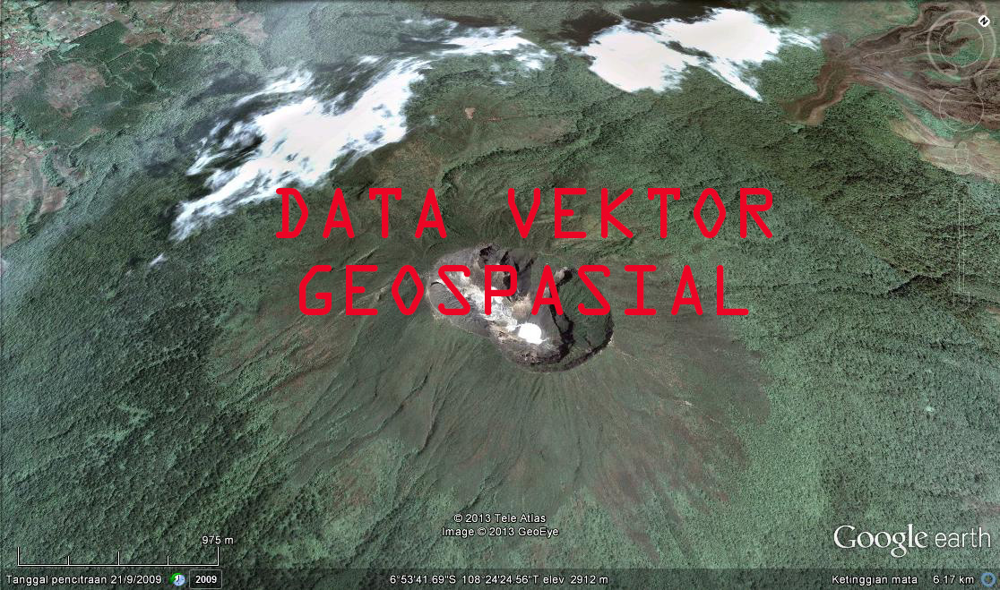

**RESUME PERTEMUAN 3 SISTEM INFORMASI GEOGRAFIS**

  

**Latar Belakang Masalah**

1. Apa yang dimaksud dengan data vektor?
2. Apa itu shapefile dan fungsinya?
3. Fitur apa saja yang dibutuhkan untuk melihat data dan jumlah data shapefile?

**ISI**

        **Data vektor**  adalah data yang menampilkan dan mempresentasikan pola suatu ruang dimuka bumi dalam bentuk kurva,titik,garis dan polygon.data vektor ini biasanya digunakan untuk mempresentasikan jalan,gedung,rel kereta dan letak koordinat.didalam vektor ini terdapat class yaitu shapefile atau shp.

 berikut merupakan contoh dari data vektor:

  

        **Shapefile** adalah format dari suatu data geospasial yang umum digunakan untuk perangkat lunak Sistem Informasi Geografis. Shapefile ini merupakan kumpulan file yang berekstensi .shp .shx dan .dbf.fungsi dari shapefile ini sendiri yaitu untuk melakukan perhitungan jumlah kota yang ada pada ruang lingkup tertentu menggunakan beberapa sistem.

        **Fitur yang dibutuhkan** untuk melihat data dan menghitung jumlah data shapefile yaitu Phyton,pyshp dan pip.ketiganya dapat di proses pada program CMD(Command Prompt) maupun terminal yang terdapat pada sistem operasi windows,Linux dan Mac.

**Penutup**

Kesimpulan

        Dari penjelasan diatas dapat dsimpulkan bahwa didalam data vektor terdapat class yang dinamakan shapefile,shapefile ini merupakan format dari suatu data geospasial yang umum digunakan untuk perangkat lunak Sistem Informasi Geografis, fungsi dari shapefile ini yaitu untuk melakukan perhitungan jumlah kota dan fitur yang dibutuhkan untuk melihat data dan menghitung jumlah data shapefile yaitu Phyton,pyshp dan pip.

Saran

Saran dari saya yaitu agar pembelajaran ini harus lebih kompleks mengacu pada teori dan prakteknya agar dapat lebih memahami cara-cara dalam menentukan jumlah shapefile serta dapat mengerti dalam penggunaan program python,pyshp dan pip.

Link github:

https://github.com/yandarizky/sisteminformasigeografis

Nama : yanda rizky prasetiya

NPM : 1144004

Kelas : 3C

Prodi : D4 Teknik Informatika

Mata Kuliah : Sistem Informasi Geografis

Link mata kuliah: www.awangga.net

referensi: https://id.wikipedia.org/wiki/Shapefile

Scan Plagiarisme:
1. https://drive.google.com/open?id=0ByZqhNt9UFJ2UVpOdXQtYW5EdUU
2. https://drive.google.com/open?id=0ByZqhNt9UFJ2bzNTaGx3YTNlYU0

