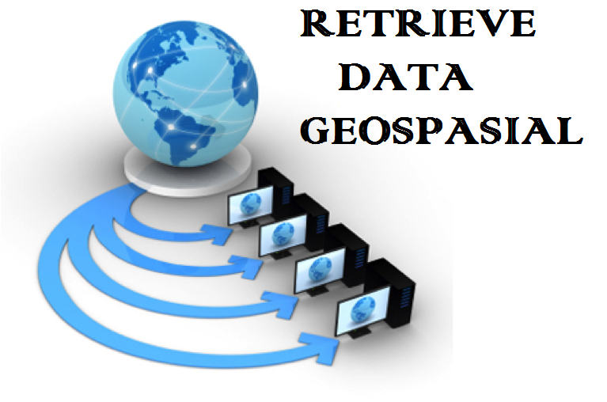

**RESUME PERTEMUAN 4 SISTEM INFORMASI GEROGRAFIS**

  

**Latar Belakang Masalah**

Pada pertemuan 4 ini akan membahas mengenai retrieve data geospasial.Retrieve itu sendiri biasa digunakan untuk mengambil data geometri dari file shp.

1. Apa yang dimaksud dengan retrieve?
2. Apa yang dimaksud dengan dbf?
3. Apa yang dimaksud dengan shp?

**ISI**

**Retrieve adalah** Cara untuk mengambil data geometri atau database data geospasial pada file shp.

**DBF adalah** sebuah file yang menyimpan file tabular yang menyimpan data attribut.

Membaca data DBF

&gt;&gt; import shapefile

&gt;&gt; sf.records()

&gt;&gt; sf.records(n)

**SHP adalah** bentuk file yang terletak didalam shapefile yang menyimpan data dari geometri. Didalam file shp terdapat data-data yaitu meliputi :

1. Bbox merupakan sebuah boundary box (koordinat dari 4 titik) atau koordinat titik batas view pada peta.
2. Point merupakan titik dari koordinat
3. Shapetype merupakan jenis data geometri yang mempunyai standar nomor yang ditetapkan oleh ESRI seperti no 1 yaitu poin, 2 yaitu polygon dan 3 untuk polyline.

**PENUTUP**

**Kesimpulan**

Dari penjelasan-penjelasan diatas dapat di simpulkan bahwa retrieve adalah Cara untuk mengambil data geometri atau database data geospasial pada file shp,didalam file SHP terdapat data-data yaitu meliputi Bbox,point dan shapetype.

**Saran**

Saran dari saya yaitu agar pembelajaran mengenai materi ini lebih diperdalam lagi dan perbanyak praktek agar tidak menguasai dari segi teori saja.

Link github:

https://github.com/yandarizky/sisteminformasigeografis

Nama : yanda rizky prasetiya

NPM : 1144004

Kelas : 3C

Prodi : D4 Teknik Informatika

Mata Kuliah : Sistem Informasi Geografis

Link mata kuliah: www.awangga.net

referensi: https://id.wikipedia.org/wiki/Shapefile

Scan Plagiarisme:

1. https://drive.google.com/open?id=0ByZqhNt9UFJ2ZU9wbkJCV25yV1E

2. https://drive.google.com/open?id=0ByZqhNt9UFJ2N3JSVjdvbWg4QTQ

