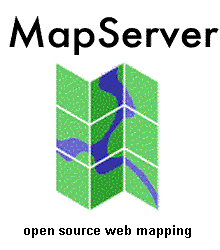

**Resume Pertemuan 7 Sistem Informasi Geografis**

  

**Latar Belakang**

1. Apa yang dimaksud dengan Map Server?
2. Apa yang dimaksud Map Proxy?
3. Bagaimana cara install Map Server?
4. Bagaimana cara install Map Proxy?
5. Bagaimana cara testing?

**ISI**

**Map Server adalah** aplikasi untuk mengubah data vektor geospasial menjadi gambar untuk ditampilkan sebagai web service.

**Map Proxy adalah** program yang berfungsi untuk menampung hasil gambar dari map server agar konsumsi komputer bisa di reduksi

**Cara install Map Server:**

1. Jika tidak ada centos maka jalankan saja di virtual box, ISO centos dan virtual box ada di halaman download

2. Setelah itu pastikan koneksi jaringan virtual box bisa diakses dari komputer host

3. Dicentos buka terminal, login sebagai root

4. install mapserver 

5. Selesai

**Cara Install Map Proxy:**

1. Install python-pip dan python-dev

2. install python-pip dan python-dev

3. pip Install mapproxy

4. install mapproxy

5. Install Vwsqi

6. install Vwsqi

**Cara Testing: **

1. Download peta Indonesia beserta map proxy konfigurasinya di Halaman Download simpan di folder/var

2. Jalankan map proxy dengan cara ketik perintah #vwsqi map proxy ini

3. Peta seudah bisa diakses di browser localhost

**Penutup**

**Kesimpulan**

Dari penjelasan-penjelasan diatas dapat disimpulkan bahwa Map Server adalah aplikasi untuk mengubah data vektor geospasial menjadi gambar untuk ditampilkan sebagai web service, Map Proxy adalah program yang berfungsi untuk menampung hasil gambar dari map server agar konsumsi komputer bisa di reduksi.Kemudian Dalam konfigurasi map server dan map proxy cukup mudah dengan menggunakan python karena pluginnya sudah tersedia

**Saran**

Sebaiknya kita harus mempelajari lebih dalam tentang map server dan map proxy agar lebih mengerti dan paham apa itu map proxy dan map server.

Link github:

https://github.com/yandarizky/sisteminformasigeografis

Nama : yanda rizky prasetiya

NPM : 1144004

Kelas : 3C

Prodi : D4 Teknik Informatika

Mata Kuliah : Sistem Informasi Geografis

Link mata kuliah: www.awangga.net

referensi: 

1. https://id.wikipedia.org/wiki/MapServer
	   
2. http://hollydude.blogspot.co.id/2011/12/proxy-dan-port-pengertian-cara-kerja.html

Scan Plagiarisme:

1. https://drive.google.com/open?id=0ByZqhNt9UFJ2dTVsbFpTdWVFUUE

2. https://drive.google.com/open?id=0ByZqhNt9UFJ2ODRrVnRtU0xXdzA
