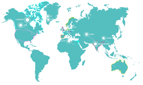

**RESUME PERTEMUAN 8 SISTEM INFORMASI GEOGRAFIS**

  

**L**  **atar Belakang Masalah**

1. Apa yang dimaksud dengan proxy?
2. Bagaimana cara kerja proxy?
3. Bagaimana cara konfigurasi Map Proxy?

**ISI**

**Proxy server adalah** sebuah komputer server yang dapat bertindak sebagai komputer lainnya yang digunakan untuk melakukan request terhadap content dari internet.

**Cara kerja proxy server adalah** client yang tersambung dengan proxy dan meminta layanann tertentu seperti file, koneksi, akses web page. Proxy server yang digunakan bertugas untuk mengevaluasi permintaan layanan tersebut sesuai dengan aturan filternya. Contohnya , proxy server dapat menyaring traffic berdasarkan IP (Internet Protocol) address. Jika permintaan ini divalidasi oleh filternya, makanya proxy akan menyediakan apa yang diminta dan meminta dengan menyambung ke server yang diminta dan meminta layanan dari server tersebut untuk clientnya.

**Konfigurasi Proxy:**

1. Pertama kita install paket Squidnya

      **apt-get install squid**

2. Setelah melakukan penginstalan kita masuk ke file squid.conf dengan perintah :

      **nano /etc/squid/squid.conf**

Lalu perintah selanjutnya kita harus mencari dan mengedit konfigurasi didalam sqiud.conf agar mudah anda dapat menekan ctrl+w (search/where is) kemudian cari tulisan dibawah ini dan diedit sesuai dengan perintah yang diberikan:

Code:

**• http\_port 3128 ( tambah tulisan &#39;transparent&#39; di belakangnya )**

**• cache\_mem 8 mb ( hapus tanda pagar yang letaknya berada didepan dan angka 8
  diganti 64 mb )**

**• cache\_swap\_low 90 ( hapus tanda pagar didepannya )**

**• cache\_swap\_high 95 ( hapus tanda pagar didepannya )**

**• cache\_mgr admin@proxy ( hapus tanda pagar didepannya, dan ditambahkan admin@(domain kamu) menjadi cache\_mgr admin@(domain kamu)**

**• visible\_hostname ( ubah menjadi visible\_hostname proxy@(domain kita)**

3. Kemudian Cari tulisan acl CONNECT (tambahkan dibawahnya) script seperti dibawah ini:

Code:

**• acl blacklist url\_regex -i &quot;/etc/squid/blacklist.txt&quot; ( letak file blacklist )**

**• acl url dstdomain &quot;/etc/squid/url.txt&quot; ( letak file url.txt )**

**• acl lan src 192.168.10.0/24( ip ini harus disesuaikan dengan ip lan yang akan berhubungan dengan client)**

**• http\_access deny blacklist**

**• http\_access deny url**

**• http\_access allow lan**

4. lalu save konfigurasi dengan tekan ctrl+o (enter) ctrl+x (enter) kemudian buat file —
    blacklist.txt &amp; url.txt dengan script dibawah ini:

1. Buka file blacklist dan url

** nano /etc/squid/blacklist.txt**

** ( masukan tulisan yang akan diblokir misal &quot;Twitter&quot;**

** nano /etc/squid/url.txt**

** ( masukan domain yang akan diblokir misalnya &quot;youtube.co.id&quot;**

  2. Lalu restart paket squid dengan perintah

     **/etc/init.d/squid restart**

     untuk melihat settingan squid sudah benar atau belum kita dapat memasukkan script:

     **squid -z**

     (jika muncul &quot;Creating Swap Directori&quot; maka konfigurasi squid telah selesai. Jalan kembali
     pake squid dengan perintah).

1. Lalu konfigurasi iptables pada rc.local untuk memforward port 80 ke port squid 3128, dengan perintah:

**nano /etc/rc.local**

**iptables -t nat -A PREROUTING -p tcp -d 0/0 –dport 80 -j REDIRECT –to-ports 3128**

**PENUTUP**

**Kesimpulan**

Proxy server adalah sebuah komputer server atau program komputer yang dapat bertindak sebagai komputer lainnya untuk melakukan request terhadap content dari internet.

**Saran**

Sebaiknya kita harus mempelajari dan memahami lebih dalam lagi mengenai map proxy yaitu dari mulai install dan konfigurasi nya agar lebih mengerti dan paham lagi.

Link github:

https://github.com/yandarizky/sisteminformasigeografis

Nama : yanda rizky prasetiya

NPM : 1144004

Kelas : 3C

Prodi : D4 Teknik Informatika

Mata Kuliah : Sistem Informasi Geografis

Link mata kuliah: www.awangga.net

referensi: 

1. https://id.wikipedia.org/wiki/Server_proksi

Scan Plagiarisme:

1. https://drive.google.com/open?id=0ByZqhNt9UFJ2UERYN20yQ1RyOFk

2. https://drive.google.com/open?id=0ByZqhNt9UFJ2bzBfZjh0Z2FtVUk