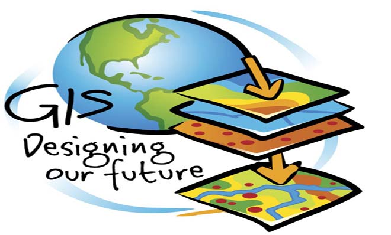

**RESUME PERTEMUAN 9 SISTEM INFORMASI GEORGRAFIS**

  

**LATAR BELAKANG MASALAH**

1. Apa yang dimaksud dengan web service geospatial?
2. Apa yang dimaksud dengan open geospatial consortium?
3. Apa saja tipe-tipe yang terdapat pada web service geospatial?

**ISI**

**Web service geospatial adalah** bagian dari OGC(open geospatial consortium) untuk kebutuhan penggunaan data geospatial di pemrograman berbasis GIS.

**Open Geospatial Consorium adalah** organisasi internasional yang mengatur standar format penggunaan data geospasial.

**Tipe-tipe yang terdapat pada web service geospatial:**

1.Web Map Service (WMS)

Web Map Service (WMS) memberikan pengguna sarana untuk melayani peta georeferensi yang disediakan database GIS menggunakan jaringan internet. WMS menghasilkan peta dalam format gambar seperti : PNG, JPEG atau GIS dan dapat ditampilkan pada browser.

2.Web Map Tile Service (WMS)

Web Map Tile Service (WMTS) hampir sama dengan Web Map Service (WMS), perbedaannya WMTS mengirimkan tiles (kebanyakan ukurannya 256×256 pixel), sementara WMS mengirimkan satu gambar per permintaan. Keuntungan utama dari tiles adalah bahwa tiles dapat pre-render pada sisi server, dan cache di sisi klien Hal ini akan mengurangi waktu menunggu data dan bandwidth.

3.Web Feature Service (WFS)

Web Feature Service (WFS) adalah antarmuka yang memungkinkan pengguna untuk mengakses dan memanipulasi informasi fitur geospasial dari sumber jaringan terdistribusi. operasi dasarnya termasuk GetCapabilities, DescribeFeatureType dan GetFeature.

4.Web Coverage Service (WCS)

Web Coverage Service (WCS) merupakan raster standar pelayanan OGC yang mengambil informasi geospasial yang berkaitan dengan fenomena multidimensi pada titik-titik dalam ruang yang berbeda-beda di wilayah geografis. Setiap WCS menyediakan akses ke informasi melalui tiga operasi: GetCapabilities, DescribeCoverage, dan GetCoverage.

**PENUTUP**

**KESIMPULAN**

Dari penjelasan-penjelasan diatas dapat disimpulkan bahwa Web service geospatial adalah bagian dari OGC(open geospatial consortium) untuk kebutuhan penggunaan data geospatial di pemrograman berbasis GIS dan Open Geospatial Consorium adalah organisasi internasional yang mengatur standar format penggunaan data geospasial.

**Saran**

Diharapkan memahami materi secara mendetail dan mencari bacaan-bacaan yang lain agar lebih paham dan banyak pengetahuan.

Link github:

https://github.com/yandarizky/sisteminformasigeografis

Nama : yanda rizky prasetiya

NPM : 1144004

Kelas : 3C

Prodi : D4 Teknik Informatika

Mata Kuliah : Sistem Informasi Geografis

Link mata kuliah: www.awangga.net

referensi: 

1. http://magic.lib.uconn.edu/help/help_OGC.html

Scan Plagiarisme:

1. https://drive.google.com/open?id=0ByZqhNt9UFJ2RllGS19JQkVHVFk

2. https://drive.google.com/open?id=0ByZqhNt9UFJ2cGN3Y0hVTTgydjA